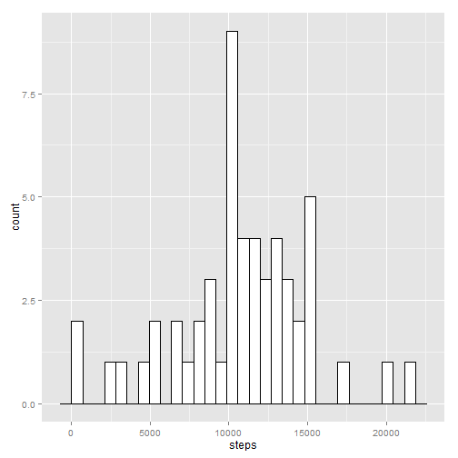

It is now possible to collect a large amount of data about personal movement using activity monitoring devices such as a Fitbit, Nike Fuelband, or Jawbone Up. These type of devices are part of the "quantified self" movement - a group of enthusiasts who take measurements about themselves regularly to improve their health, to find patterns in their behavior, or because they are tech geeks. But these data remain under-utilized both because the raw data are hard to obtain and there is a lack of statistical methods and software for processing and interpreting the data.

This assignment makes use of data from a personal activity monitoring device. This device collects data at 5 minute intervals through out the day. The data consists of two months of data from an anonymous individual collected during the months of October and November, 2012 and include the number of steps taken in 5 minute intervals each day.


The aim of this paper is to analyise the "Activity Monitoring Dataset" and draw certain conclusions. This is done as a part of The Coursera Course- Reporducible Research- Assignment -1

###Data Analysis
####Loading and preprocessing the Data


```r
tab <- read.csv("C:/Users/SONY/Documents/activity.csv",sep=",",na.strings="NA",colClasses=c("integer","factor","factor"))
tab$date <-as.Date(tab$date)
a <- tab[complete.cases(tab),]
a[,3] <-as.character(a[,3])
a[,3] <-as.numeric(a[,3])
head(tab)
```

```
##   steps       date interval
## 1    NA 2012-10-01        0
## 2    NA 2012-10-01        5
## 3    NA 2012-10-01       10
## 4    NA 2012-10-01       15
## 5    NA 2012-10-01       20
## 6    NA 2012-10-01       25
```
####Average Daily Pattern
Using the steps above the data is loaded into R and NA cases are removed . 

The first part of the assignment asks us to evaluate the mean total number of steps taken each day.(Ignoring the missing values)

A histogram of the total number of steps is plotted below


```r
library(ggplot2)
new <- aggregate(formula = steps ~ date, data = a, FUN = sum)
ggplot(new, aes(x=steps)) + geom_histogram(colour="black", fill="white")
```

```
## stat_bin: binwidth defaulted to range/30. Use 'binwidth = x' to adjust this.
```

 
 


Next the assignment asks us to evaluate the mean and medain of the total number of steps taken each day
 
**The mean number of steps taken are**

```r
mean(new$steps)
```

```
## [1] 10766
```
**The median number of steps taken are**

```r
median(new$steps)
```

```
## [1] 10765
```


####Time Series Plot
Our next job is to evaluate the daily activity pattern. For this we make a time series plot of the 5-minute interval (x-axis) and the average number of steps taken, averaged across all days (y-axis). For the analysis below `aggregate()` function has been used to evaluate the mean number of steps across all intervals


```r
new <- aggregate(formula = steps ~ interval, data = a, FUN = mean)

plot(new$interval,new$steps,type="l",xaxt='n',xlab="time",ylab="Average number of steps")
new[,1] <-as.numeric(new[,1])
axis(1, at=c(1,0600,1200,1800,2400),labels=c("0:00","06:00","12:00","18:00","24:00"))
```

 

The 5-minute interval, on average across all the days in the dataset,which contains the maximum number of steps is


```r
new[new$steps==max(new$steps),]
```

```
##     interval steps
## 104      835 206.2
```


####Inputting missing values
In case of our anaylsis we want to get an idea about the level of activity per day of the individual in question. The activity of the individual is measured by the sum of steps per day in 5 minute intervals. Naturally the individual wasn't moving in every 5 minute interval, which explains the high number of zero values. By summing over the intervals these zero values have no effect on the downstream analysis. What about the NA values however? We don't really know anything about the reasons whether these values are missing structurally, possibly because the individual was sick or overtrained, or whether the missing values are a result of a malfunctioning measurement device. The latter case would imply an uninformative missingness, such that these values could simply be replaced by a naive measure like the mean of the number of steps on this day, or any other way of imputation, keeping the introduced bias to a minimum. Imputing the values in the former case however, would introduce a bias, because the state of health of the individual, would not imply that he or she would have a comparable perfomance level during these times. Unfortunately we can't ask the individual and the course material provides no additional information about the experimental setup than the description on the peer assessment page. For the sake of the argument, let's assume that the missing values are a result of a malfunctioning measurement device. We can then savely impute the missing values, by computing the mean.

The following is basically the same analysis than before, but with the missing values in the original dataset, replaced by the mean of the number of steps In the following two figures we can see how the imputed values are integrated into the dataset.

1.Calculate the total number of rows with missing valies i.e `NA`


```r
table(is.na(tab))
```

```
## 
## FALSE  TRUE 
## 50400  2304
```
Thus the total number of missing values are 2304


```r
tab$steps <- ifelse(is.na(tab$steps) == TRUE, new$steps[new$interval %in% tab$interval], tab$steps)
```

3. We thus create a new data sets which is similar to the old data set except with the NA values filled in.

```r
newdata <- aggregate(formula = steps ~ date, data = a, FUN = sum)
head(newdata)
```

```
##         date steps
## 1 2012-10-02   126
## 2 2012-10-03 11352
## 3 2012-10-04 12116
## 4 2012-10-05 13294
## 5 2012-10-06 15420
## 6 2012-10-07 11015
```


We plot a histogram of the new data set to compare ot to the old data set and evaluate the mean and median


**The mean number of steps taken are**


```r
mean(newdata$steps) 
```

```
## [1] 10766
```
**The median number of steps taken are**


```r
median(newdata$steps)
```

```
## [1] 10765
```

```r
ggplot(newdata, aes(x=steps))+geom_histogram(colour="black", fill="blue")
```

```
## stat_bin: binwidth defaulted to range/30. Use 'binwidth = x' to adjust this.
```

 
We can see that the values are approximately normal distributed and that the distribution with the imputed values is slightly sharper. This is result of an increased density around the mean value, because we replaced 2304 missing values with the mean value of the original data. By doing that we didn't change the general truth about the data, or in other words we did not introduce a shift on the x-axis of the whole distribution. However we implicitly added certainty, that the model, constructed by our sample, is correctly distributed around this mean.


#### Activity patterns between weekday and Weekends.

For this part of the assignment `weekdays()` function has been used. The new dataset with `NA`s filled is used.

1.A new factor variable in the dataset with two levels - "weekday" and "weekend" indicating whether a given date is a weekday or weekend day is created


```r
tab[,4] <- weekdays(tab[,2])

for (i in 1:17568){
  if (tab[i,4]=="Sunday"){tab[i,5] <- "Weekend" }
  else if (tab[i,4]=="Saturday"){tab[i,5] <- "Weekend" }
  else { tab[i,5] <-"Weekday"}
} 

tab[,5]<- as.factor(tab[,5])
tab[,3]<- as.numeric(tab[,3])
```

2.A panel plot containing a time series plot (i.e. type = "l") of the 5-minute interval (x-axis) and the average number of steps taken, averaged across all weekday days or weekend days (y-axis) is plotted below. (Lattice plot is used)


```r
library(lattice)
newweek <- aggregate(tab$steps,list(interval = tab$interval, week = tab$V5),mean)
newweek[,1]<-newweek[,1]
xyplot(x~interval|week,data=newweek,type="l",ylab="No of steps taken",layout=c(1,2))
```

 

The highest activity level can be seen between 8 and 10 in the morning during the weekdays.

--------The End----------

Thank you for reading.


Have a good day..


